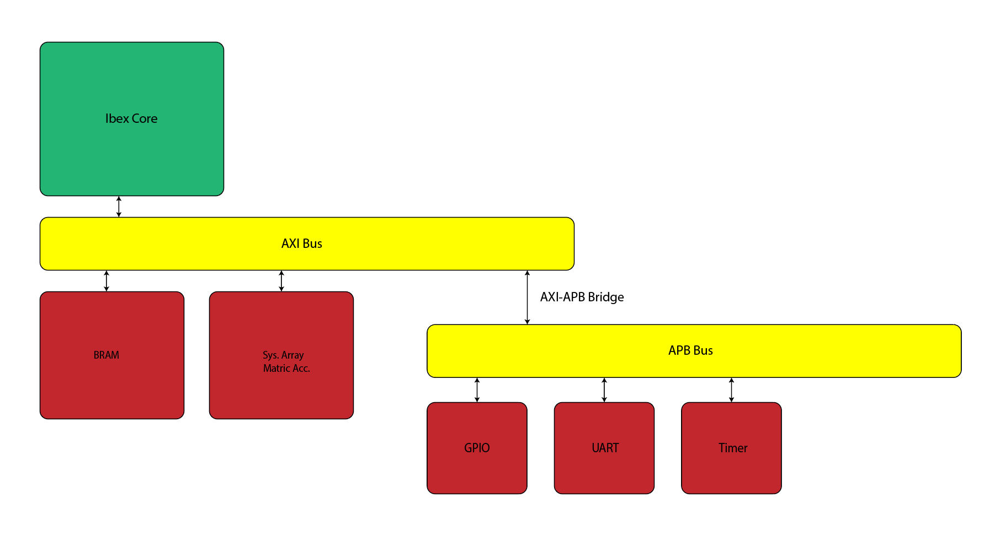

# Matrix Multiplication RISC-V SoC
## By Saul Rodriguez

A RISC-V SoC centered around a hardware systolic-array matrix multiplication accelerator.

The project is intended to explore practical RTL and SoC design concepts including RISC-V integration, AMBA buses, memory-mapped peripherals, DMA, clock-domain crossing (CDC), asynchronous FIFOs, FPGA prototyping, and ASIC implementation using open-source EDA tools.

The design is initially targeted for the Digilent Basys 3 FPGA and will later be synthesized and physically implemented using an open-source ASIC flow (LibreLane and Yosys).

## Architecture

The SoC uses the open-source lowRISC Ibex RV32 processor as its control CPU. The processor communicates with system memory, the matrix accelerator, and peripheral subsystem through an AXI-based system interconnect.

Low-bandwidth peripherals are connected through an AXI4-Lite-to-APB bridge. The matrix multiplication accelerator contains a DMA frontend and a parameterized systolic array.

The accelerator compute engine operates in a separate clock domain from the main SoC. Asynchronous FIFOs and synchronized control paths are used to safely transfer data and control information across the clock-domain boundary.



### Major Components

- **Ibex RISC-V CPU**
  - 32-bit RISC-V processor
  - Executes bare-metal firmware
  - Controls peripherals and the matrix accelerator

- **AXI Interconnect**
  - Main system interconnect
  - Connects the processor, memory, and accelerator
  - Supports memory-mapped communication and accelerator DMA traffic

- **System Memory**
  - Unified instruction and data memory
  - Implemented using FPGA BRAM during FPGA prototyping
  - Holds program instructions, program data, stack, and matrix data
  - Intended to be replaced by an SRAM-based implementation for the ASIC target

- **AXI4-Lite to APB Bridge**
  - Converts AXI4-Lite transactions into APB transactions
  - Provides access to low-bandwidth memory-mapped peripherals

- **APB Peripheral Subsystem**
  - UART
  - GPIO
  - Timer
  - Additional peripherals may be added as the design develops

- **Matrix Multiplication Accelerator**
  - Parameterized systolic array
  - Pipelined multiply-accumulate processing elements
  - AXI4-Lite control/status interface
  - AXI DMA interface for reading operands and writing results
  - Supports larger matrix operations through tiling

- **Clock-Domain Crossing**
  - Separate system and accelerator clock domains
  - Asynchronous FIFOs for operand and result streams
  - Synchronizers/handshakes for control and status signals
  - Per-domain reset synchronization

## Memory Map

The following is the initial system memory map. Addresses and region sizes may change as the SoC is developed.

| Address Range | Size | Device | Interface | Description |
|---|---:|---|---|---|
| `0x0000_0000 - 0x0001_FFFF` | 128 KiB | System BRAM | AXI | Unified instruction and data memory |
| `0x4000_0000 - 0x4000_0FFF` | 4 KiB | Matrix Accelerator | AXI4-Lite | Accelerator control and status registers |
| `0x8000_0000 - 0x8000_0FFF` | 4 KiB | UART | APB | Serial communication |
| `0x8000_1000 - 0x8000_1FFF` | 4 KiB | GPIO | APB | LEDs, switches, buttons, and general-purpose I/O |
| `0x8000_2000 - 0x8000_2FFF` | 4 KiB | Timer | APB | System timer and interrupt generation |
| `0x8000_3000 - 0x8000_3FFF` | 4 KiB | SoC Control | APB | System configuration and status |

### Accelerator Register Map

The accelerator will use memory-mapped control and status registers within the `0x4000_0000` region.

| Offset | Register | Description |
|---:|---|---|
| `0x00` | `CONTROL` | Start/reset accelerator operation |
| `0x04` | `STATUS` | Busy, done, and error status |
| `0x08` | `A_ADDR` | Base address of matrix A |
| `0x0C` | `B_ADDR` | Base address of matrix B |
| `0x10` | `C_ADDR` | Base address of result matrix C |
| `0x14` | `M` | Matrix M dimension |
| `0x18` | `N` | Matrix N dimension |
| `0x1C` | `K` | Matrix K dimension |
| `0x20` | `IRQ_ENABLE` | Accelerator interrupt enable |
| `0x24` | `IRQ_STATUS` | Accelerator interrupt status/acknowledge |

The exact register behavior is subject to change as the accelerator interface is developed.

## Accelerator Data Flow

Software stores matrices A and B in system memory and programs the accelerator with their memory addresses and matrix dimensions.

A matrix multiplication operation follows the general sequence:

1. Ibex configures the accelerator through its memory-mapped control registers.
2. The accelerator DMA engine reads matrix A and matrix B from system memory over AXI.
3. Operand data is transferred into asynchronous FIFOs.
4. The FIFOs transfer operands from the system clock domain into the accelerator clock domain.
5. The systolic array performs the matrix multiplication.
6. Results cross back into the system clock domain through an asynchronous result FIFO.
7. The DMA engine writes matrix C back to system memory.
8. The accelerator raises an interrupt to notify the processor that the operation has completed.

## Clock Domains

The design uses two primary clock domains:

| Clock | Domain |
|---|---|
| `clk_sys` | Ibex, AXI, BRAM, APB, peripherals, DMA frontend |
| `clk_accel` | Systolic array and accelerator compute logic |

Clock-domain crossings use asynchronous FIFOs for multi-bit streaming data and synchronizer/handshake circuits for control and status signals.

The initial implementation may operate entirely from a single clock while the basic SoC is brought up. The accelerator will then be moved into its own clock domain.

## FPGA Target

The initial hardware target is the **Digilent Basys 3** FPGA development board.

The FPGA implementation will use board resources including:

- Artix-7 FPGA
- Block RAM
- LEDs
- Slide switches
- Push buttons
- UART
- FPGA clock-management resources

Board-specific RTL and constraints are kept separate from the technology-independent SoC RTL.

## ASIC Target

After FPGA validation, the SoC will be adapted for an open-source ASIC implementation flow.

FPGA-specific resources will be replaced with ASIC equivalents where necessary:

| FPGA Implementation | ASIC Implementation |
|---|---|
| FPGA BRAM | SRAM macro / memory wrapper |
| MMCM/PLL resources | ASIC clock-generation abstraction |
| FPGA I/O | ASIC I/O/pad cells |
| Vivado synthesis/implementation | Yosys + OpenLane/OpenROAD |

The CPU, bus logic, peripherals, accelerator, DMA, and CDC RTL are intended to remain largely technology-independent.

## Verification

Verification will include unit-level and system-level testing of:

- Systolic-array arithmetic
- Ready/valid interfaces
- AXI transactions
- APB transactions
- AXI-to-APB protocol conversion
- DMA transfers
- Interrupt behavior
- Asynchronous FIFOs
- CDC control paths
- Reset behavior
- Firmware-controlled accelerator operation

Matrix multiplication results will be compared against a software reference model.

The project uses open-source simulation and verification tools where practical, including Verilator, Icarus Verilog, and Yosys-based formal flows.

## Repository Structure

```text
Matrix_Mult_SoC/
├── docs/             # Documentation
├── rtl/              # Technology-independent RTL
├── tb/               # Testbenches and verification
├── firmware/         # Bare-metal RISC-V software
├── fpga/             # Basys 3 FPGA implementation
├── asic/             # ASIC implementation files
├── scripts/          # Build and utility scripts
├── third_party/      # External IP and Git submodules
│   ├── ibex/
│   └── ibex-demo-system/
├── IBEX_VERSION
└── README.md